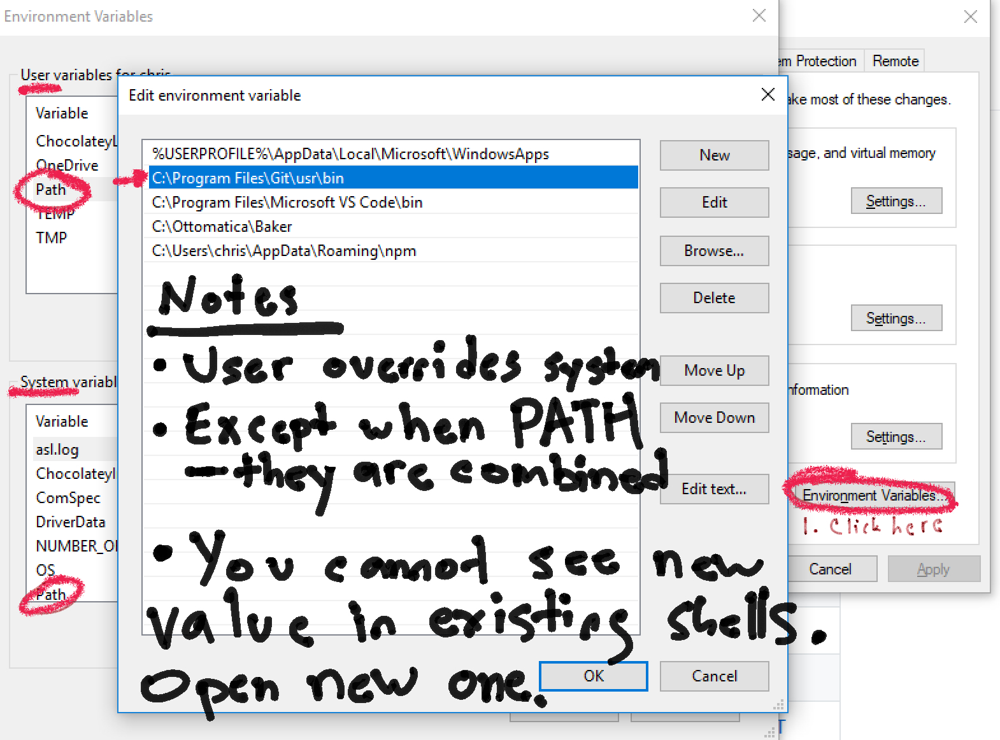
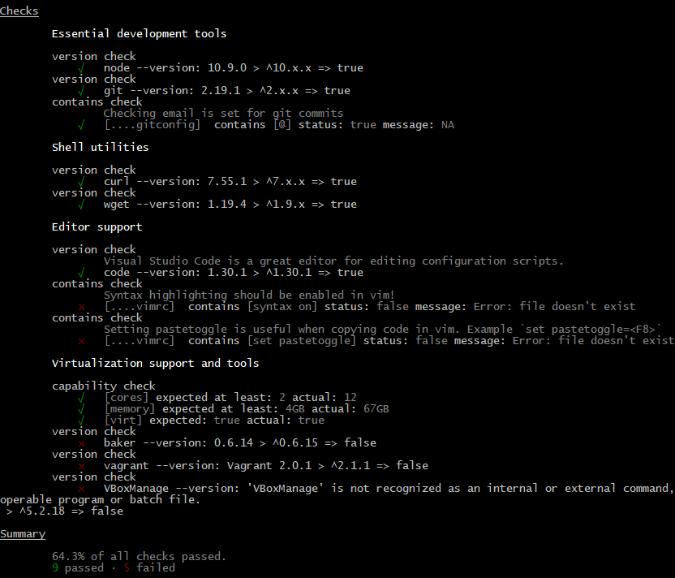

[Setup](Setup.md#setup) | [Shells](Shells.md#shells) |  [Git](Git.md#git) | [Markdown and IDEs](MarkdownEditors.md#markdown) |  [Virtual Environments](Environments.md#environments) | [Task Management](OnlineTools.md#online-tools)

# Setup

To successfully build software, you need a properly configured environment with a variety of tools. To help us get started, we will we install some tools, package managers, that make it a little easier to configure systems. 

Whether you're a Mac, Windows, or Linux user---you should be able to find a way to be productive with the tools from this workshop. However, there may be specific tweaks, issues, and accomodatations you may have to make based on your platform.

## An installation philosophy

> *Avoid manual installation, automate with package managers!*

When possible, using a package manager can allow you to automate and streamline the installation of tools. Instead of hunting down the right website, finding the right version and dowload link, then clicking through an installation wizard---you let the package manager take care of all those manual steps for you! 

*Tip*: Later on, the ability to automate the installation of software environments becomes important in later stages of software development, such as continuous integration, or deployment.

### Package Managers

*Package managers* are tools for installing libraries and tools, which help manage dependencies and configuration of files and environment variables. 

There are generally two flavors of package managers. *Binary* package managers typically install platform specific dependencies, whereas, *source* package managers typically install libraries you can use in your code.

* **Binary**: brew, choco, apt-get  
* **Source**: npm, pip, maven

### Installing Package Managers

If you're using Linux, you typically already have a package manager, such as `yum` or `apt-get`. You can skip this step.

##### Installing HomeBrew on Mac OS X

Homebrew is a popular package manager for MacOS. To install, open a terminal window and run the install command shown on [http://brew.sh/](http://brew.sh/).

Here is an example of how to install the utility `wget`.
```bash
brew install wget
```

##### Installing Chocolatey on Windows

Chocolatey is a package manager for Windows. 

Follow the instructions on the [Chocolatey website](https://chocolatey.org/install) to install. 
Once Chocolatey is installed, you can use it to install other tools on your system using `choco install <package-name>`.  Look for the package name on the Chocolatey website.


We will check if we have choco installed.

```bash|{type: 'command', failed_when:"!stdout.includes('Chocolatey v')"}
choco --V
```

Important, when running commands that will make changes to your system, you may need to "Run (them) as Administrator". Notice, how when we run this command, `choco` warns us that we are not running inside an elevated shell.

```bash|{type: 'command'}
choco install wget -y
```

We can try again, but this time, with a shell that has administrative priliveges:

```bash|{type: 'command', privileged: true}
choco install wget -y
```

Finally, we can remove `wget` using the `remove` parameter.

```bash|{type: 'command', privileged: true}
choco uninstall wget -y --remove-dependencies
```

## Practice: Installing useful software

See if you can find the packages for these tools with your package manager and install them (if you do not already have them).

* git
* node.js
* python2

## Optional: Make Windows Just as Awesome

If you have **Windows 10**, you can use the [Windows Subsystem for Linux](https://docs.microsoft.com/en-us/windows/wsl/about)!  Follow the [Windows 10 Installation Guide](https://docs.microsoft.com/en-us/windows/wsl/install-win10).

*Tip*: You can also get many of the same commands available in your windows shell environment by installing git and ensuring they exist on your path.

* Update your System Environment Variables Path to include: `C:\Program Files\Git\usr\bin`. 
* Restart your shell and many unix commands will work in windows too!

You can install even more unix utilities:
* Install gnuwin basic utils for windows: `choco install gnuwin32-coreutils.install`
* Update your System Environment Variables Path: `C:\Program Files (x86)\GnuWin32\bin`




## opunit

[opunit](https://github.com/ottomatica/opunit) is a simple tool for verifying the configuration of a machine, including your laptop and or any virtual machines you may have created.

By running opunit, you'll be able to verify your machine is correctly setup for a course, workshop, or homework assignment. 

In the simpliest case, opunit can check if you have the right versions of software installed. Beyond these simple checks, opunit can also verify the correct configuration of software and services that you'll be automating later in the course.

### Installing opunit

opunit requires [node.js](https://nodejs.org/en/) to be installed.

You can then install using npm:

```bash
npm install ottomatica/opunit -g
```

### Checking your local machine

You can check your local machine against a course profile, but running the following command:

```bash
opunit profile CSC-DevOps/profile:510.yml
```

The resulting output might look something like this image below. The green check ✔️ indicates that a check was passed, while the red x ❌ indicates that a check failed.

For example, the first check will validate whether the version of node.js satisties the semver requirement of being at least `^10.x.x` or greater.

Notice that one of the checks under "Editor Support", fails to validate. This check looks for syntax highlighting being enabled for vim. This check fails because the .vimrc file is not presence on system.

If you have any questions about why a check fails or passes on your system, reach out to a TA or instructor.



### Running opunit for a workshop/assignment

You run opunit against a local profile, which is useful when working on an assignment or workshop.

For example, if you are working on the [Pipelines workshop](https://github.com/CSC-DevOps/Pipelines), you can run opunit against the profile located in test/opunit.yml

```bash
opunit verify local
```

This will check whether you have correctly setup your pipeline for the workshop. Before doing anything, it would be expected for most checks to fail. As you complete more steps from the workshop, more checks should pass!


### Running opunit against a virtual machine

opunit can be run against a virtual machine, both locally on your machine, as well as remote virtual machines created on platforms such as AWS or digital ocean.

Further instructions will be provided when we get to this step.
